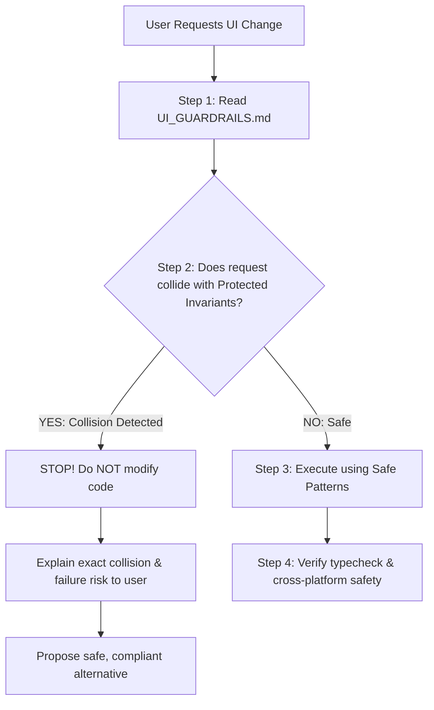

# UI Guardrails & AI Safety Protocol (Carrinex / Ceranix)

> **CRITICAL DIRECTIVE FOR ALL AI AGENTS:**
> Before proposing, planning, or executing **ANY** UI, styling, navigation, or component changes in this codebase, you **MUST** read this document first.
> Cross-check the requested changes against the **Protected Invariants** and **Collision Matrix** below. If the request collides with a protected rule or risks breaking cross-platform stability, **YOU MUST STOP AND WARN THE USER** before touching the code.

---

## 1. AI Pre-Flight Protocol (Collision Detection Workflow)

Whenever the user asks for a UI change, layout alteration, new feature, or styling tweak, follow this mandatory 4-step sequence:



### Stop Condition (Collision Detected)
If a user prompt asks you to:
1. Use `className` on a `<Pressable>`,
2. Add gradients, decorative stickers, or a 4th brand color,
3. Import raw `Text` from `react-native`,
4. Remove scroll bottom padding around the floating tab bar,
5. Bypass `GuestGate` or auth checks on transactional flows,
6. Add multiple primary purple buttons on a single screen, or
7. Introduce serif/decorative fonts or web-only globals without guards;

**YOU MUST NOT SILENTLY COMPLY.** You must respond:
> ⚠️ **UI Guardrail Collision Warning:** Your request to `[Action]` conflicts with `[Rule Name / Invariant]` in `UI_GUARDRAILS.md`.
> - **Why this breaks the program:** `[Technical reason, e.g., silently drops styles on iOS/Android, causes layout overflow, breaks the 60fps gesture worklet]`
> - **Recommended Safe Alternative:** `[How we can achieve your goal safely within the design system]`

---

## 2. Protected Framework & Runtime Invariants (Technical Rules)

These rules protect the runtime from silent crashes, style collapse, and mobile/web rendering desync.

### Rule 2.1: Never Use `className` on `<Pressable>` (`lib/pressableInterop.ts`)
- **The Invariant:** `<Pressable>` is deliberately un-registered from NativeWind’s `cssInterop` via `disablePressableInterop()` in `app/_layout.tsx`.
- **The Risk:** Applying `className="..."` on `<Pressable>` **silently fails** on native platforms. Worse, passing `style={({ pressed }) => ...}` to a NativeWind-wrapped Pressable silently drops `flexDirection`, `position: absolute`, borders, and padding, causing buttons and chips to disintegrate on iOS and Android.
- **Enforced Pattern:**
  ```tsx
  // ❌ FORBIDDEN: Silently breaks on native
  <Pressable className="flex-row items-center p-4 bg-white" onPress={...}>

  // ✅ REQUIRED: Use style object or style function
  <Pressable
    onPress={...}
    style={({ pressed }) => ({
      flexDirection: 'row',
      alignItems: 'center',
      padding: 16,
      backgroundColor: pressed ? theme.panel : theme.surface,
    })}
  >
  // ✅ OR: Use PressableScale for spring feedback
  <PressableScale onPress={...} style={{ ... }}>
  ```

---

### Rule 2.2: Typography Must Use `@/lib/rnText` or `<AppText>` (`lib/rnText.tsx`)
- **The Invariant:** One typeface only: **Inter**. Never import `Text` or `TextInput` directly from `react-native`.
- **The Risk:** Stock React Native `Text` does not link to `@expo-google-fonts/inter`. Without the shim, text defaults to the OS system font (San Francisco / Roboto), and on web causes flash of unstyled text or tofu characters.
- **Enforced Pattern:**
  ```tsx
  // ❌ FORBIDDEN: Missing font mapping
  import { Text, TextInput } from 'react-native';

  // ✅ REQUIRED: Automatic Inter weight mapping
  import { Text, TextInput } from '@/lib/rnText';
  // ✅ OR: Use the AppText design primitive
  import { AppText } from '@/components/ui/Text';
  ```
- **Animated Text Caveat:** `<Animated.Text>` (from Reanimated or RN Animated) wraps the raw component and does not go through the shim. You **MUST** set `fontFamily` explicitly (e.g. `fontFamily: typography.family.sansBold` or `'Inter_700Bold'`).
- **No Serif Fonts:** No serif, script, or secondary font family is permitted anywhere in the app.

---

### Rule 2.3: Safe Area Insets & Floating Dock Clearance (`components/AnimatedTabBar.tsx`)
- **The Invariant:** The bottom navigation bar is a floating, blurred dock (`AnimatedTabBar.tsx`) that hovers above the bottom edge.
- **The Risk:** Removing `paddingBottom` on scrollable lists or detail pages causes the bottom items, CTA buttons, or form inputs to be permanently obscured underneath the floating dock.
- **Enforced Pattern:**
  - All tab screen scroll containers (`ScrollView`, `FlatList`, `FlashList`) must account for the dock:
  ```tsx
  const insets = useSafeAreaInsets();
  const bottomPadding = insets.bottom + 80; // Safe clearance for floating dock

  <ScrollView contentContainerStyle={{ paddingBottom: bottomPadding }}>
  ```
- **Do NOT replace or rewrite `AnimatedTabBar.tsx`:** The dock uses Reanimated worklets that run strictly on the UI thread to keep 60fps gestures during list scrolling. Never introduce React state into gesture worklets.

---

### Rule 2.4: Cross-Platform Compatibility (Expo Web + iOS + Android)
- **The Invariant:** The codebase compiles to iOS, Android, and Cloudflare Pages Web.
- **The Risk:** Writing platform-specific code without guards breaks either native builds or web bundling.
- **Enforced Invariants:**
  1. **No direct DOM globals:** Never access `window`, `document`, or `localStorage` without `Platform.OS === 'web'` guards or using AsyncStorage/SecureStore.
  2. **No Web-only CSS in RN style objects:** Properties like `cursor: 'pointer'`, `filter`, `userSelect`, `outline` are invalid in React Native native styles. If needed on web, guard with `Platform.select({ web: { ... } })`.
  3. **Alerts:** React Native Web ships `Alert.alert` as a no-op. The app uses `installAlertShim()` or dedicated modal dialogs (`PromptDialog.tsx`, `DropAlertSheet.tsx`). Do not rely on un-shimmed native alerts.

---

### Rule 2.5: Auth Gateways & Transaction Security
- **The Invariant:** `GuestGate.tsx` and `RequireAuth.tsx` protect transactional and personalized actions: Make Offer, Buy Now, List an Item, Direct Message, and Saved Items.
- **The Risk:** Bypassing or removing `useGuestGate()` allows unauthenticated users to trigger failed Supabase RPC calls, corrupting checkout or chat state.
- **Enforced Pattern:**
  - Keep `useGuestGate()` wrapped around any newly added user-interactive CTA that requires an authenticated session.

---

## 3. Strict Design Language Invariants ("The Quiet Atelier" - `DESIGN.md`)

Carrinex is a disciplined, quiet-luxury resale marketplace. Restraint communicates trust.

| Invariant | Forbidden (AI Must Reject) | Enforced Standard |
| :--- | :--- | :--- |
| **Color Palette** | Any 4th color (no blue, green, orange, yellow). No ad-hoc hex values like `#3B82F6` or `#10B981`. | **The Three-Hue Rule:** Only Signal Purple (`#6C47FF`), Paper White (`#FFFFFF`), and Ink (`#0F0F0F` / `#111111` at calibrated opacities). Semantic red (`#EF4444`) is permitted *only* for destructive/danger states. |
| **Gradients** | Any gradient backgrounds, gradient buttons, or gradient text. | **Zero Gradients Rule:** Flat surfaces only. All gradient tokens resolve to flat colors. |
| **Resale Clutter** | Poshmark/Depop-style badges, ribbons, star ratings, stickers, promotional overlays, or emoji as decoration. | Clean, quiet presentation. Product photography and seller words are the centerpiece. Use Feather or Ionicons, never decorative emoji. |
| **Action Hierarchy** | Multiple filled purple buttons on the same screen. | **One Primary Action Rule:** Exactly ONE primary purple CTA per screen. Secondary actions must be Ghost (white + hairline border), Dark (ink), or Soft (purple tint). |
| **Shadows** | Dramatic, heavy, dark drop-shadows (>16% opacity). | **Whisper Shadow Rule:** Shadows must be ≤16% opacity, flat by default, or color-matched to the element casting it. |
| **Button Shapes** | Rectangular or sharp-cornered buttons. | All interactive buttons and chips must use **Pill Radius** (`rounded: 999px`). Containers use `16px–28px` radius. |
| **Micro-Interactions**| Color swapping on press. | Physical spring give: scale to `0.97` and opacity to `0.9` on press (`PressableScale`). |
| **Shield / Protection Icon** | Divergent shield icons or colors (e.g. Vinted teal `#007782`, non-purple fills, or ad-hoc outlines). | **Unified Shield Icon Rule:** All buyer protection and verification marks across the entire application (Home feed `ListingCard`, `RelatedItemCard`, Product detail `ProductOverviewHeader`, `BuyerProtectionSheet`, `SafetyBanner`, `CheckoutSheet`, `SettingsHero`, `ProfileHeader`) **MUST** use `<ShieldCheckIcon>` matching the canonical product page shield (Signal Purple `#6C47FF` / `theme.purple`). Never introduce teal, green, or alternate shield icons. |
| **Resting & Active Chips** | Using recessed grey fills (`#F6F6F6` / `theme.surface`) on inactive controls, or colorful purple pills (`#EDE9FE`) on active filter chips during browsing. | **Paper White Resting & Solid Ink Active State:** Inactive buttons, search bars, and filter chips on white pages must use clean Paper White (`theme.panel` / `#FFFFFF` in light mode) with hairline borders (`theme.border`). Active or applied filter chips invert to Solid Ink (`theme.ink` / `#111111`) with crisp white text and white icons, keeping browse feeds calm and preserving purple for the primary CTA. |

---

## 4. Protected File & Subsystem Registry

The following files represent high-risk architectural hubs. Any AI asked to modify them must exercise maximum caution:

| File / Directory | Subsystem | Why it is Protected |
| :--- | :--- | :--- |
| `components/ui/ShieldCheckIcon.tsx` | Visual Identity / Trust | Canonical Buyer Protection and verification icon across the entire app. Matches product page styling. |
| `components/AnimatedTabBar.tsx` | Bottom Navigation | Threading model: Gesture runs on UI thread via Reanimated worklets. React state here destroys scroll performance. |
| `lib/pressableInterop.ts` | Styling Engine | Prevents NativeWind from swallowing functional styles on `<Pressable>`. Must remain imported in `app/_layout.tsx`. |
| `lib/rnText.tsx` | Font Engine | Inter font-family injection for every Text component in the app. |
| `context/ThemeContext.tsx` | Theming | Manages light/dark/system mode, AsyncStorage hydration, and monotone tokens. |
| `lib/theme.ts` | Design Tokens | Single source of truth for color opacities, typography sizes, and radii. |
| `components/ListingCard.tsx` | Feed Performance | Renders in `FlashList`. Uses raw `expo-image`, cached like states, unified `<ShieldCheckIcon>`, and strict 4:5 aspect ratio. |
| `components/chat/ListingBar.tsx` | Transaction Flow | Pinned to bottom above chat composer deliberately to keep negotiation item in context. |
| `components/GuestGate.tsx` | Auth Guard | Guards authenticated actions; prevents unauthenticated RPC errors. |
| `app/_layout.tsx` | Root Providers | Controls font preloading, Sentry, Alert shim, and React Query offline persistence. |

---

## 5. Collision Detection Matrix (Quick Reference)

Before proceeding with a user request, match it against this matrix:

| User Asks For... | Collision Detected? | Why It Collides | Safe Alternative / Path Forward |
| :--- | :---: | :--- | :--- |
| *"Use a different shield icon or teal '#007782' shield on cards"* | 🔴 **YES** | Violates Unified Shield Icon Rule & Three-Hue Rule. | Use canonical `<ShieldCheckIcon>` from `@/components/ui/ShieldCheckIcon` matching product page purple. |
| *"Add a colorful badge (e.g. green 'Verified' or orange 'Sale')"* | 🔴 **YES** | Violates Three-Hue Rule & Anti-Clutter Rule. | Use Ink at opacity or subtle purple hairline badge with a clean Feather icon (`Check`, `Shield`). |
| *"Make the CTA button a gradient"* | 🔴 **YES** | Violates Zero Gradients Rule. | Use solid Signal Purple (`#6C47FF`) with Reanimated scale spring feedback. |
| *"Use Tailwind `className` to style this button"* | 🔴 **YES** (if `<Pressable>`) | Silently drops styles on iOS/Android (`lib/pressableInterop.ts`). | Use inline `style` or `PressableScale` for the Pressable; use `className` only on `<View>` or `<Text>`. |
| *"Import standard `<Text>` from `react-native`"* | 🔴 **YES** | Bypasses Inter font mapping; triggers font flash and tofu boxes. | Import `{ Text } from '@/lib/rnText'` or use `<AppText>`. |
| *"Remove the bottom gap/padding on the feed screen"* | 🔴 **YES** | Content will be hidden beneath the floating `AnimatedTabBar`. | Keep `contentContainerStyle={{ paddingBottom: insets.bottom + 80 }}`. |
| *"Add a serif font for this headline"* | 🔴 **YES** | Violates One Typeface Rule (Inter only). | Use `Display` or `Headline h1` variant of Inter with heavy weight (`700`/`900`) and tight tracking (`-1px`). |
| *"Add a second prominent purple button next to 'Buy Now'"* | 🔴 **YES** | Violates One Primary Action Rule. | Keep 'Buy Now' as primary purple; make 'Make Offer' ghost or dark. |
| *"Add an unauthenticated quick checkout / chat"* | 🔴 **YES** | Bypasses `GuestGate` security, crashing Supabase RPC queries. | Wrap the action in `guestGate.gate(() => proceed())`. |
| *"Make unselected buttons, search bars, or chips grey (#F6F6F6)"* | 🔴 **YES** | Violates Paper White Resting State; makes active controls look disabled/greyed out. | Use Paper White (`theme.panel` / `#FFFFFF` in light mode) with hairline border (`theme.border`) for resting controls. |
| *"Add dark mode styling for this new component"* | 🟢 **NO** | Safe, provided `useTheme()` tokens are used. | Use `const { theme, isDark } = useTheme();` and bind to `theme.surface`, `theme.panel`, etc. |

---

## 6. Emergency Override Procedure

If the user **explicitly insists** on overriding one of these rules after receiving the AI's warning:
1. The AI must explicitly state:
   > *"Proceeding with this override violates `[Rule Name]`. This may cause `[Specific Breakage, e.g. native style degradation or brand inconsistency]`. Applying the requested change per your explicit confirmation."*
2. Isolate the change as locally as possible so it does not infect global files or break shared components.
3. Never bypass core runtime crash protections (such as `disablePressableInterop()` or font blocking).
