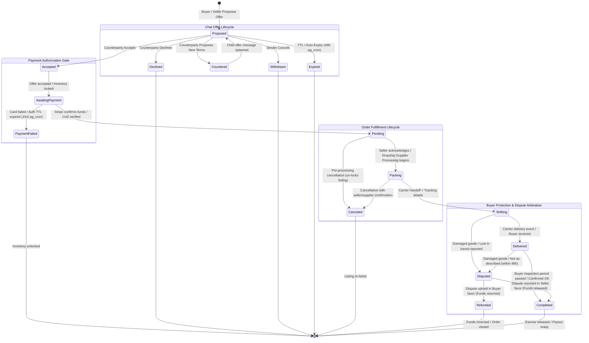

# Ceranix Order Lifecycle Architecture & State Machine Specification

## 1. Executive Summary & Core Invariants

This document establishes the authoritative architecture, database schema, state machine specifications, idempotency guarantees, and concurrency models for the **Ceranix Order Lifecycle and Chat Integration System**.

The system establishes a deterministic bridge between conversational in-chat offers and durable order fulfillment, backed by PostgreSQL ACID guarantees, Stripe Payment-Authorization gates, and Supabase Realtime synchronization.

---

## 2. Complete State Machine & Transition Graphs

---

## 3. Database Schema & Transition Invariants

### 3.1 Chat Offer State Enum (`offer_status`)
Offers are embedded in `public.messages` where `kind = 'offer'`:
- `proposed`: Initial active offer (alias/canonical for pending negotiation).
- `accepted`: Counterparty agreed; locks inventory and initiates order.
- `declined`: Counterparty rejected. Terminal.
- `countered`: Counterparty proposed revised terms. Links to predecessor via `parent_offer_id`.
- `withdrawn`: Revoked by original sender before acceptance. Terminal.
- `expired`: Swept by `pg_cron` after 48 hours without response.

### 3.2 Order Fulfillment States (`fulfillment_status`)
- `awaiting_payment`: Order created via offer acceptance; inventory held; waiting for Stripe authorization or CoD verification.
- `pending`: Payment authorized/verified. Seller notified to fulfill.
- `packing`: Active preparation milestone. Dynamically represents:
  - **Direct Resale:** "Packing" (seller is packaging the garment).
  - **Dropship / External:** "Supplier Processing" (dispatched to supplier warehouse).
- `shifting`: Handed over to courier with tracking number (`shifted_at = now()`).
- `delivered`: Carrier delivery webhook or buyer receipt confirmation (`delivered_at = now()`).
- `completed`: Inspection window satisfied or buyer explicit confirmation (`completed_at = now()`). Escrow released to seller.
- `disputed`: Buyer protection claim opened for damaged/missing goods. Payout frozen.
- `canceled`: Pre-transit cancellation. Item relisted.

---

## 4. Edge Cases & Reliability Invariants

### 4.1 Stripe Webhook Idempotency with `p_stripe_event_id`
Stripe webhooks can occasionally deliver duplicate events. To prevent duplicate payment captures or double-transitions:
- A dedicated table `public.processed_webhooks (event_id text primary key, event_type text, processed_at timestamptz default now())` records incoming events.
- In `confirm_order_payment_authorization(p_order_id, p_stripe_event_id, ...)`:
  - The function inserts `p_stripe_event_id` into `processed_webhooks`.
  - If a primary key collision (`23505`) occurs, the RPC exits immediately without mutating the order, guaranteeing idempotency.

### 4.2 Automated TTL Expiration via `pg_cron`
Rather than relying on client-side date checks, background sweeps run at the database level:
- Scheduled via Supabase `pg_cron` running every 5 minutes:
  - Sweeps offers with `offer_status in ('proposed', 'pending')` older than 48 hours $\to$ marks `expired`.
  - Sweeps orders with `fulfillment_status = 'awaiting_payment'` older than 15 minutes $\to$ marks `failed`, unlocks listing (`is_sold = false`).

### 4.3 Flexible Packing vs Supplier Processing (Dropship Support)
- Column `fulfillment_type text not null default 'direct' check (fulfillment_type in ('direct', 'dropship'))`.
- Columns `supplier_name text` and `supplier_order_id text`.
- Stepper renders:
  - Direct: **Packing** (*"Seller packaging your order"*).
  - Dropship: **Supplier Processing** (*"Sent to supplier / warehouse"*).

### 4.4 Defense-in-Depth for `SECURITY DEFINER` RPCs
Every `SECURITY DEFINER` function enforces:
1. `IF auth.uid() IS NULL THEN RAISE EXCEPTION 'Unauthorized'` (`42501`).
2. Row-level `SELECT ... FOR UPDATE` lock on `public.orders`.
3. Explicit actor verification:
   - Seller-only for `packing` and `shifting`.
   - Buyer-only for `delivered`, `completed`, and `disputed`.
4. Execution privileges explicitly revoked from `public, anon` and granted strictly to `authenticated` or `service_role`.
